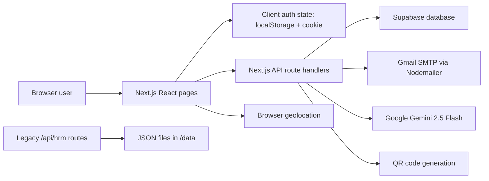
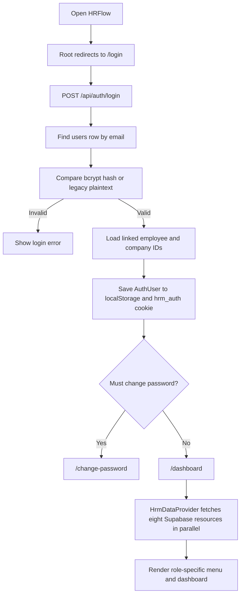

# HRFlow Project Overview

## Purpose

HRFlow is a full-stack human resource management web application aimed at Pakistan-based organizations. It brings employee records, attendance, leave, payroll, recruitment, performance, announcements, office settings, reports, and AI-assisted HR work into one interface.

The current application is built as a Next.js 14 App Router project. The browser renders role-specific pages and calls Next.js API route handlers. Most active business data is stored in Supabase. A separate JSON-file API and demo data set still exist in the repository as a legacy path.

## Intended Users

The source code defines five roles, in descending rank:

1. **Super Admin** - cross-company administration and full navigation.
2. **Company Admin** - administration within a company.
3. **HR Manager** - day-to-day HR operations within the available company scope.
4. **Team Lead** - team attendance, leave, and performance work.
5. **Employee** - self-service attendance, leave, payroll, performance, announcements, and AI chat.

Role definitions and menu visibility come from `lib/types.ts` and `lib/auth.ts`.

## Main Modules

| Module | Main purpose |
|---|---|
| Authentication | Email/password login, forced password change, bcrypt migration, OTP password reset, logout |
| Company management | Create/list companies and link Company Admin accounts to companies |
| Employee management | Directory, create/update/delete, CSV export, temporary credentials email |
| Attendance | Location-based self check-in, checkout, QR attendance, bulk HR override, reminders, calendars and reports |
| Leave | Apply for leave, view personal/team/all requests, approve/reject, status email |
| Payroll | Generate monthly payroll records, view payslips, mark records paid |
| Recruitment | Create jobs and move applicants through a Kanban pipeline |
| Performance | Create and edit employee reviews with ratings, goals, reviewer, and feedback |
| Announcements | Publish, filter, view, and delete company announcements |
| Dashboards | Admin, Team Lead, and Employee summaries and charts |
| Reports and AI | HR chat, anomaly analysis, churn analysis, monthly reports, HR documents, interview kits |
| Settings | Browser-local company display settings and Supabase-backed Office Profile settings |

## User-Facing Routes

| Route | Screen |
|---|---|
| `/login` | Login and demo quick-login accounts |
| `/forgot-password` | Request OTP |
| `/forgot-password/verify` | Verify six-digit OTP |
| `/forgot-password/reset` | Set a new password |
| `/dashboard` | Role-specific dashboard |
| `/employees` | Employee directory and management |
| `/attendance` | Personal, team, and all attendance views |
| `/attendance/bulk` | Bulk/manual attendance override |
| `/attendance/qr` | Employee QR code |
| `/leaves` | Leave request and approval workspace |
| `/payroll` | Payroll and payslips |
| `/recruitment` | Applicant pipeline and job postings |
| `/performance` | Performance reviews |
| `/announcements` | Company announcements |
| `/ai-assistant` | HR data chat |
| `/ai-assistant/documents` | HR document and interview-kit generator |
| `/ai-assistant/anomalies` | Attendance anomaly analysis |
| `/reports` | Monthly AI report and churn-risk analysis |
| `/settings` | Company lists, holidays, and Office Profile |
| `/settings/change-password` | Voluntary password change |
| `/change-password` | Forced password change |

## High-Level System Flow

## Login and Application Loading Flow

## Data Sources

### Active Supabase path

The main UI uses `/api/employees`, `/api/attendance`, `/api/leaves`, `/api/payroll`, `/api/jobs`, `/api/applicants`, `/api/performance`, and `/api/announcements`. These route handlers use the Supabase service-role client.

### Legacy JSON path

`/api/hrm`, `/api/hrm/[resource]`, and `/api/hrm/[resource]/[id]` read and write files under `/data` through `lib/fake-db.ts`. The current `HrmDataProvider` does not use these routes.

### Browser-local settings

The Company, Departments, Designations, Locations, and Holidays settings object is generated from employee data/defaults and stored under `hrflow_settings` in browser localStorage. The separate Office Profile tab uses the Supabase `office_profiles` table.

## External Integrations

- **Supabase**: application database; both anon and service-role clients are created.
- **Google Gemini API**: model `gemini-2.5-flash` for AI chat, reports, analysis, documents, and interview kits.
- **Gmail SMTP**: Nodemailer transport at `smtp.gmail.com:587` for credentials, leave status, attendance reminder, and OTP emails.
- **Browser Geolocation API**: captures employee and office coordinates.
- **QRCode package**: produces attendance QR data URLs.
- **Recharts**: dashboard and analytics charts.
- **Vercel/Next.js runtime**: the repository is structured for Next.js deployment; no provider-specific deployment file is present.

## Background Work

No cron configuration, queue, worker, or scheduled job was found. Attendance reminder emails run synchronously only when `POST /api/attendance/reminder` is called from the sidebar or bulk attendance screen. AI and email calls also run synchronously inside request handlers.

## Important Boundaries

- Middleware checks only for the presence of the `hrm_auth` cookie; it does not validate its value or role.
- Auth details and company scope are stored in localStorage and sent as `x-user-role` and `x-company-id` headers.
- Many API routes do not independently verify the caller's identity or allowed role.
- The Supabase service-role key bypasses normal row-level restrictions when used by the API.
- These implementation details are documented more fully in `09-technical-notes.md` and `10-missing-or-unclear-items.md`.
