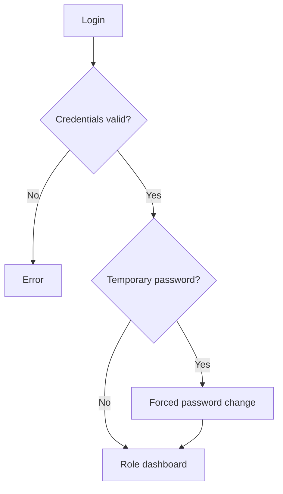
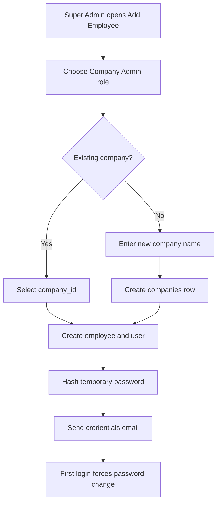
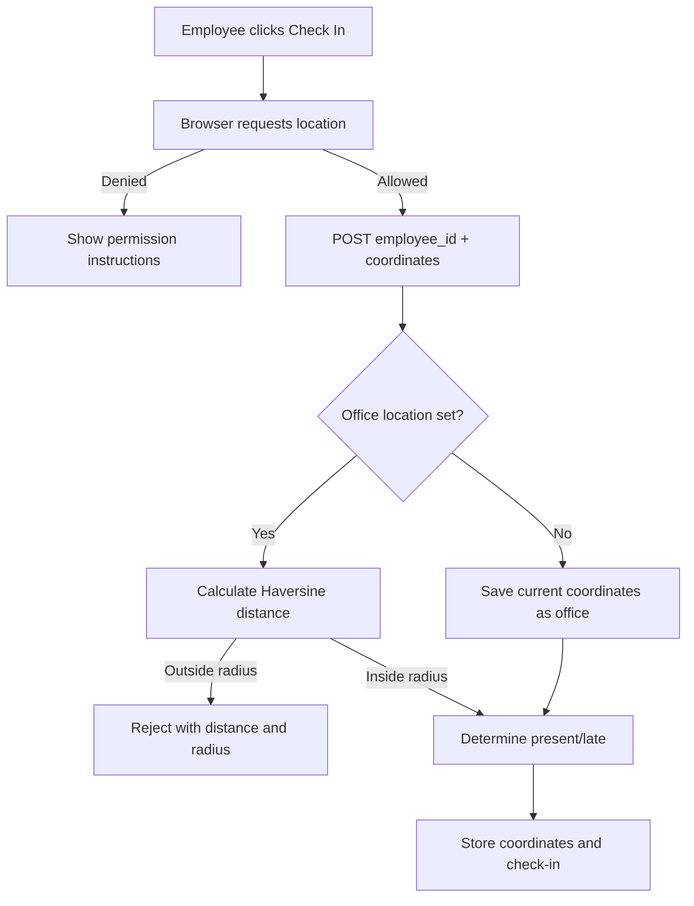

# Role-Based Flows

This document describes behavior visible in the current source code. "Can access" usually means the sidebar/page code exposes the feature. It does not imply that every API has strong server-side authorization.

## Shared Login Flow for All Roles

1. The user opens `/login` and enters email/password or selects one of four demo quick-login accounts.
2. `POST /api/auth/login` looks up the `users` row by email.
3. The API uses bcrypt when `password_hash` exists; otherwise it compares the legacy `password` field.
4. The API loads a linked employee record to obtain name, employee ID, and fallback company ID.
5. The browser stores the returned user under `hrm_auth` in localStorage and sets an `hrm_auth` cookie containing the user ID.
6. A user with `mustChangePassword` is forced to `/change-password` until the password is changed.
7. Other users go to `/dashboard`, where the role selects an Admin, Team Lead, or Employee dashboard.

## Super Admin

### Purpose

Cross-company administrator. This is the highest rank in `ROLE_RANK` and is the only role explicitly allowed by the Companies API to create a company.

### Navigation

Dashboard, Employees, Attendance, Leaves, Payroll, Recruitment, Performance, Announcements, AI Assistant, Reports, and Settings.

### Main flows

1. **Create a company and Company Admin**
   - Open Employees and choose Add Employee.
   - Choose `Company Admin` as Account Role.
   - Select an existing company or enter a new company name.
   - Saving creates an employee row, a bcrypt-protected user row, links both to the company, and emails temporary credentials.
2. **Manage employees**
   - Search/filter, view, add, edit, delete, or export CSV.
3. **Manage organization-wide HR operations**
   - View all loaded attendance, leave, payroll, recruitment, performance, and announcement data.
4. **Configure settings**
   - Edit browser-local company/departments/designations/holidays view.
   - Edit Supabase-backed Office Profile and company policies.
5. **Use reports and AI**
   - Admin dashboard, monthly reports, churn analysis, anomaly view, AI chat, documents, and interview kits.

### Related APIs

`/api/companies`, `/api/employees`, all main HR CRUD APIs, `/api/office-profile`, AI/report APIs, and auth APIs.

### Emails/notifications

- New employee/Company Admin credentials email.
- Leave approval/rejection emails when actions are taken.
- Attendance reminders when manually triggered.

### Validations and edge cases

- Company Admin creation requires `company_id` or `new_company_name`.
- Duplicate user email is rejected.
- If user creation fails after employee creation, the new employee row is deleted.
- If credentials email fails, employee and user creation have already happened; the API returns a 500 with the created employee.
- Super Admin requests without a company header are intentionally unscoped in many routes.

## Company Admin

### Purpose

Company-level administrator intended to see and manage only the linked company's records.

### Navigation

The main role map includes all standard modules and Settings. The dashboard uses the Admin dashboard component.

### Main flows

- Manage employees in the linked company; newly created employee accounts inherit the Company Admin's company ID.
- View and manage company attendance, leave, payroll, recruitment, performance, and announcements through company-scoped CRUD routes.
- Maintain Office Profile details, work hours, attendance radius, work days, logo, and custom policies.
- Use monthly reports, churn analysis, and most AI features.

### Related APIs

The browser sends `x-user-role: company_admin` and `x-company-id`. Most active CRUD routes filter by that company ID or by employees/jobs belonging to it.

### Emails/notifications

Same operational emails as Super Admin when the corresponding actions are used.

### Validations and edge cases

- Company scoping depends on client-supplied headers, not a signed session.
- `AppSidebar` helper flags omit `company_admin` from some Attendance submenu actions and Anomalies visibility even though the main role map grants broader access.
- Leave page tab conditions omit Company Admin from Team/All tab checks, while `canApproveLeaves` includes Company Admin.
- These mismatches are listed in `10-missing-or-unclear-items.md`.

## HR Manager

### Purpose

Runs day-to-day HR administration: people records, attendance, leave, payroll, hiring, performance, announcements, reports, and office profile.

### Navigation

Dashboard, Employees, Attendance, Leaves, Payroll, Recruitment, Performance, Announcements, AI Assistant, Reports, and Settings.

### Main flows

1. Add/edit/delete employees and send onboarding credentials.
2. View all available attendance, bulk-mark attendance, and send reminders.
3. Apply for leave for self and approve/reject requests visible in team/all views.
4. Generate payroll records, open payslip details, and mark processing records paid.
5. Create jobs and move applicants through stages.
6. Create/edit performance reviews.
7. Publish/delete announcements.
8. View Office Profile. HR Manager cannot see the browser-local Company/Departments/Designations/Holidays tabs because those require `canEditGlobalSettings`.

### Related APIs

All main HR resource APIs, Office Profile, reports/AI, and attendance helpers.

### Emails/notifications

- Credentials email on employee creation.
- Leave decision email.
- Attendance reminders on manual action.

### Validations and edge cases

- HR Manager company isolation only occurs when the stored user has a company ID.
- Bulk attendance is always stored as `hr_override` and bypasses location checks.
- Reminder endpoint itself does not filter by company and has no role check.

## Team Lead

### Purpose

Monitor and manage direct reports, team attendance, leave approvals, and team performance.

### Navigation

Dashboard, Attendance, Leaves, Performance, Announcements, and AI Assistant.

### Main flows

1. View Team Lead dashboard: team size, attendance, pending leave, average rating, attendance chart, performance summary, and pending approvals.
2. Open Attendance team view and Bulk Mark screen.
3. View My Leaves and Team Leaves; approve/reject pending requests.
4. Create or edit performance reviews for team members.
5. Read announcements and use AI chat/documents/anomalies as exposed by the sidebar.

### Team calculation

Team membership is based on `Employee.managerId`. However, Supabase employee mapping currently sets `managerId` to `null`, so team membership may be empty for Supabase-loaded employees.

### Emails/notifications

Approving/rejecting leave sends a status email to the employee.

### Validations and edge cases

- Team Lead has UI access to bulk attendance, which writes `hr_override` even though the note describes HR/Admin override.
- Team/API restrictions depend on client-side filtered employee lists; APIs generally do not validate direct-report relationships.

## Employee

### Purpose

Personal HR self-service.

### Navigation

Dashboard, Attendance, Leaves, Performance, Announcements, and AI Assistant.

### Main flows

1. **Attendance**
   - Browser requests precise location.
   - `POST /api/attendance/checkin` validates coordinates and office radius.
   - If no office location exists, the first employee check-in sets it.
   - Employee checks out later; hours are calculated from timestamp difference.
   - Employee can generate a daily QR code.
2. **Leave**
   - Apply with type, start/end dates, and reason.
   - View personal request statuses and dashboard balance.
3. **Payroll**
   - The sidebar does not expose Payroll to Employees, although Payroll page code contains a personal-record filtering branch.
4. **Performance**
   - View personal reviews; no create/edit action for Employee.
5. **Announcements and AI**
   - Read announcements, ask HR chat questions, and use document generation.

### Emails/notifications

- OTP email for password reset.
- Leave approval/rejection email.
- Attendance reminder email if HR manually calls the reminder action.

### Validations and edge cases

- Employee must be linked to an employee record for self-service attendance.
- Location permission and valid coordinates are mandatory for normal self check-in.
- Duplicate daily check-in is rejected.
- Checkout requires a previous check-in and rejects a second checkout.
- QR scan uses a separate path and does not enforce office location radius.

## No Other Runtime Roles Confirmed

No additional role is present in the TypeScript `Role` union or the current Supabase role constraint. The repository does not contain a runtime `role_permissions` model/API despite the role hierarchy constant.
