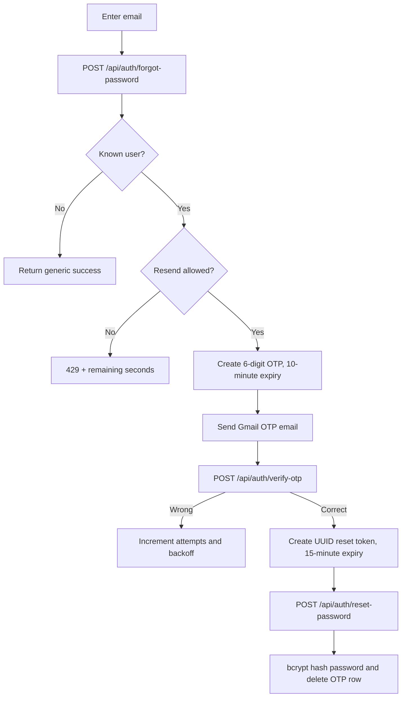
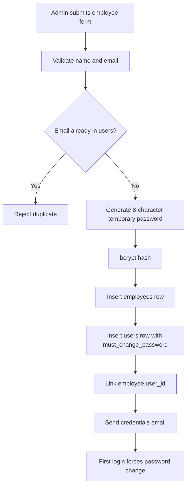
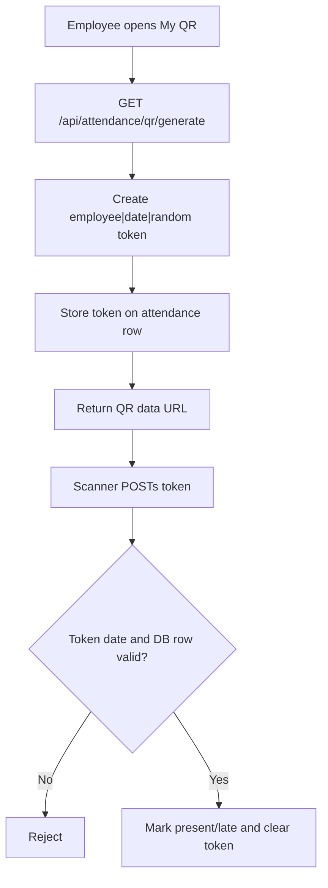
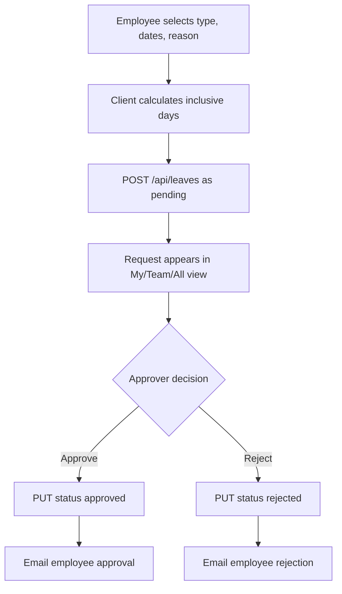
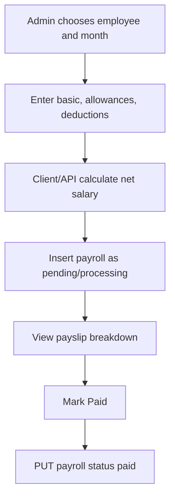
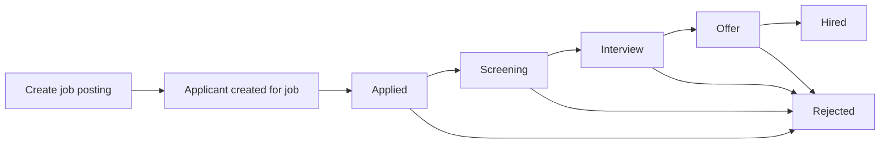

# Feature Modules

## 1. Authentication and Password Management

### Purpose

Authenticate users, force temporary-password replacement, and support OTP password reset.

### Access

- Login and forgot-password pages are public.
- Change-password pages require the client auth state/cookie through the dashboard layout or middleware.

### User flow

1. Login with email/password.
2. Server selects a user by email and compares bcrypt `password_hash`, falling back to legacy plaintext `password` during migration.
3. Browser stores an `AuthUser` object in localStorage and an ID-only cookie.
4. Temporary-password accounts are redirected to `/change-password` and browser back navigation is blocked on that page.
5. Voluntary changes are available at `/settings/change-password`.

### Forgot password flow

### Data and services

- Tables: `users`, `employees`, `password_reset_otp`.
- Services: bcryptjs, `lib/otp.ts`, `lib/mailer.ts`.
- Hash cost: 10 rounds.
- OTP resend delay: 1, 2, 5, 10, then 30 minutes.

### Validation and edge cases

- New password must have at least 8 characters, uppercase, lowercase, and a number; confirmation must match in UI.
- Forgot-password returns generic success for unknown email to reduce account enumeration.
- Wrong OTP updates resend timing but the verify endpoint does not reject verification attempts based on `next_allowed_at`.
- Password migration endpoint is a public GET endpoint and should be treated as one-time tooling.

## 2. Company Management and Multi-Company Scope

### Purpose

Create companies, assign Company Admin/employee records, and limit most data to a company.

### Access

- `GET /api/companies`: returns all companies unless a non-Super-Admin company header scopes it.
- `POST /api/companies`: explicitly checks `x-user-role === super_admin`.
- Super Admin creation UI appears inside Add Employee.

### Company creation flow

1. Super Admin opens Add Employee.
2. Selects Company Admin role.
3. Selects an existing company or enters a new company name.
4. Employee API optionally creates `companies` row.
5. It creates both `employees` and `users` rows with the company ID.
6. Temporary credentials are emailed.

### Data isolation implementation

- Client reads `companyId` from localStorage auth state.
- Client sends `x-company-id` and `x-user-role` headers.
- CRUD APIs filter direct company-owned tables (`employees`, `jobs`, `announcements`) or join through `employees`/`jobs`.
- Super Admin is unscoped.

### Important limitation

Headers are client-controlled and not cryptographically tied to the login cookie. This is application filtering, not strong server authentication. See `09-technical-notes.md`.

## 3. Employee Management and Onboarding

### Purpose

Maintain an employee directory and create user access for new employees/Company Admins.

### Access

UI management: Super Admin, Company Admin, HR Manager.

### User flow

- Search by name, email, code, or department.
- Filter by department/status.
- View full employee details.
- Add/edit/delete employees.
- Export visible rows to CSV.

### Onboarding flow

### Data

Tables: `employees`, `users`, optionally `companies`.

### Emails

Welcome/credentials email contains name, login email, temporary password, login URL, and password-change warning.

### Edge cases

- User insert failure rolls back only the employee row.
- Email failure does not roll back employee/user creation.
- Supabase mapping hardcodes location to Karachi, gender to a dash, and manager ID to null when reading employees.
- Deleting an employee does not explicitly delete its user account in route code.

## 4. Attendance

### Purpose

Track daily presence, lateness, check-in/out timestamps, location, QR attendance, and manual overrides.

### Access

- Main attendance page: all roles.
- Team view and bulk page: Team Lead and administrative roles according to page/sidebar checks.
- All view: roles for which `canManageEmployees` is true.
- QR page: Employee with linked employee ID.

### Location self check-in

1. Employee clicks Check In.
2. Browser requests high-accuracy geolocation with a 15-second timeout.
3. API validates latitude/longitude and employee existence.
4. API loads Office Profile for the employee company.
5. If no office location exists, current coordinates become the office location.
6. Otherwise Haversine distance is compared with `location_radius_meters`.
7. Outside-radius request receives 403 with distance/radius.
8. Inside-radius request stores coordinates, distance, timestamp, and `marked_by = self`.
9. Present/late uses Asia/Karachi current time and Office Profile check-in, late threshold, and grace period.

### Checkout

- Requires `employee_id`.
- Requires a prior check-in.
- Rejects duplicate checkout.
- Stores checkout timestamp/time and returns calculated hours.
- Checkout date uses UTC ISO date while check-in date uses Asia/Karachi formatting, which can differ near midnight.

### Bulk override

- Admin/Team Lead page sends all visible active employees for a date.
- Valid statuses: present, absent, late, half_day, wfh.
- API upserts one row per employee/date.
- Always stores `marked_by = hr_override` and an override note.
- Location restrictions are bypassed.

### QR flow

### Reminders

`POST /api/attendance/reminder` finds active employees without marked attendance and sends one Gmail reminder per employee. It is manually invoked, synchronous, not scheduled, and currently not company-scoped.

### Data

Tables: `attendance`, `employees`, `office_profiles`, `companies`.

### Edge cases

- First employee check-in can establish the office location.
- QR scan does not enforce geolocation and uses a hardcoded 9:30 threshold.
- Manual override pin is red; normal location pin is green; old records may have no distance.
- No database unique constraint on employee/date is shown in schema; route logic assumes one row.

## 5. Leave Management

### Purpose

Allow leave applications and approval/rejection workflows.

### Access

- All roles can access the Leave page and apply if linked to an employee.
- `canApproveLeaves`: Super Admin, Company Admin, HR Manager, Team Lead.
- Page tab conditions currently omit Company Admin from Team/All tabs.

### Flow

### Data and validation

- Table: `leaves`; relationships to employee and approving employee.
- Required: employee, start date, end date.
- Update only accepts approved/rejected.
- UI supports annual, sick, casual.
- Database schema also permits `wfh`, but frontend `LeaveRecord` does not.
- Dashboard balance uses hardcoded quotas: annual 20, sick 10, casual 7; pending leaves count as used.

### Email failure

The leave update remains successful. API returns HTTP 200 with `emailWarning` if email sending fails.

## 6. Payroll

### Purpose

Create monthly salary records, display payslip breakdowns, and mark payment completed.

### Access

Sidebar/page management: Super Admin, Company Admin, HR Manager. Page code contains a personal Employee filter, but Employee has no Payroll navigation item.

### Flow

### Data and validation

- Table: `payroll` linked to `employees`.
- Required: employee, month, year.
- Net = basic + bonuses - deductions when not supplied.
- UI maps database pending to `processing` and paid to `paid`.
- No payroll email, PDF generation, approval workflow, or bank integration was found.

## 7. Recruitment

### Purpose

Track jobs and applicants from application to hiring/rejection.

### Access

Super Admin, Company Admin, HR Manager.

### Flow

### UI

- Kanban applicant pipeline.
- Job filter.
- Job Postings tab.
- Add Job dialog.
- Move action advances an applicant one stage.

### Data and validation

- Tables: `jobs`, `applicants`.
- Job requires title.
- Applicant requires full name and job ID.
- Valid stages: applied, screening, interview, offer, hired, rejected.
- Resume score shown by frontend mapper is synthesized from the applicant ID, not stored resume analysis.
- No frontend flow for creating an applicant was found on the Recruitment page, although POST API exists.

## 8. Performance Management

### Purpose

Record review period, rating, goals, reviewer, and feedback.

### Access

- Read page: all roles through navigation.
- Manage: Super Admin, Company Admin, HR Manager, Team Lead.
- Employee view filters to personal reviews.
- Team Lead view attempts to filter by direct reports.

### Data and validation

- Table: `performance` linked to employee/reviewer.
- Create requires employee and a truthy rating.
- Database rating constraint is 1-5.
- Mapper derives `goalsCompleted` as 75% of goal count and always maps status to completed; those values are not represented as columns in current schema.

### Edge cases

Team behavior depends on manager IDs, but Supabase employee mapper returns manager ID as null.

## 9. Announcements

### Purpose

Publish department/all-company notices and allow all roles to read them.

### Access

- Read: all roles.
- Create/delete UI: Super Admin, Company Admin, HR Manager.

### Data and validation

- Table: `announcements`.
- Create requires title.
- UI captures priority, but database mapper always reads priority as medium and `announcementToDb` does not persist priority.
- No announcement email or persistent notification record is created.

## 10. Dashboards and Reports

### Admin dashboard

Used by Super Admin, Company Admin, HR Manager. Shows employee totals, today's attendance, leave, open jobs, payroll, pending items, charts, approvals, and recent activity.

### Team Lead dashboard

Shows team size, present today, pending leave, average rating, team attendance, performance, and leave approvals.

### Employee dashboard

Shows personal check-in state, leave balances, attendance calendar, upcoming leaves, latest payslip, and announcements.

### Data quality notes

- Missing attendance dates are filled with deterministic synthetic values for charts.
- Hiring uses real join dates; attrition is synthetic.
- Team weekly chart also creates synthetic fallback values.
- Dashboard "recent activity" is assembled from leave and announcement records, not an activity-log table.

### Monthly report

The report API aggregates active employees, joiners/exits, attendance, leave, payroll, applicants, and performance for a selected month, then asks Gemini to write sections for summary, metrics, trends, recruitment, payroll, performance, risks, and recommendations.

### Churn analysis

Deterministic score uses tenure, attendance trend, leave count, salary-change proxy from payroll history, and performance rating. Risk levels: high at 50+, medium at 25+, otherwise low. Gemini enriches the top risks; deterministic text is fallback.

### Attendance anomalies

Detects frequent lateness, excessive absence, Monday/Friday patterns, declining attendance, and perfect attendance over 90 days. Gemini creates insights/actions; deterministic fallback is available.

## 11. Settings and Office Profile

### Browser-local settings

Super Admin and Company Admin can edit Company, Departments, Designations, and view Holidays. Save writes only to browser localStorage, so changes are browser-specific.

### Office Profile

Visible to Super Admin, Company Admin, HR Manager. Supabase-backed fields include:

- Logo (base64 data URL or URL)
- Name, email, phone, address
- Check-in/out time
- Late threshold and grace period
- Monday-Saturday work-day choices
- Latitude/longitude, radius, and location-set flag
- JSON list of title/description/effective-date policies

Location can be captured from the browser, cleared, or established by the first employee self check-in.

## 12. AI Assistant and Documents

### HR chat

Detects English/Roman Urdu intents for employees, leave, attendance, payroll, recruitment, performance, and announcements. It fetches related Supabase data and asks Gemini to answer in the user's language. Payroll data is restricted in prompt data to Super Admin and HR Manager; Company Admin is not included in that API's payroll authorization check.

Chat history stores up to 50 displayed messages per user in `ai_chat_history` and supports clear-history.

### HR documents

Supported types:

- Offer letter
- Appointment letter
- Warning letter
- Termination letter
- Experience letter
- Job description
- Performance review template
- General HR policy
- Leave policy
- Remote work policy
- Code of conduct
- Performance review policy
- Salary increment policy

The API validates per-template required fields and returns plain text. The UI supports editing, copy, download, and print-oriented actions.

### Interview kit

Requires job title; optional experience level and skills. Gemini must return JSON containing five technical, three behavioral, and two culture-fit questions with evaluation guidance.

### Reusable document templates

Generated AI documents can be saved to `document_templates`. The system extracts placeholders such as `{{employee_name}}`, `{{salary}}`, and `{{joining_date}}`. Later documents of the same type and company render locally through variable substitution without calling Gemini. `/ai-assistant/documents/templates` supports use, preview, manual edit, AI regeneration, and delete actions.
