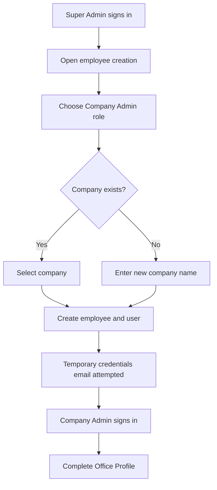
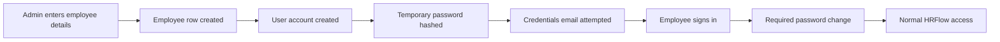

# HRFlow Administration Manual

This guide is for Super Admins, Company Admins, and HR Managers responsible for setting up and operating HRFlow.

## 1. Initial Technical Setup

Before users sign in, configure the deployment environment with the Supabase project URL, Supabase keys, Gmail SMTP credentials, application URL, and Gemini API key. Exact variable names and their code locations are listed in `09-technical-notes.md`.

Run the repository's Supabase schema and migrations against the same Supabase project used by the deployed application. Do not expose the service-role key in browser code or screenshots.

## 2. First Company Setup

1. Sign in as a Super Admin.
2. Create a Company Admin from the employee creation flow.
3. Select an existing company or enter a new company name.
4. Confirm that the new user's `company_id` and the employee's `company_id` match.
5. Sign in as the Company Admin and open **Settings > Office Profile**.
6. Complete the company information, work hours, office location, radius, and policies.

The company API only permits company creation when the request identifies the acting role as `super_admin`.

## 3. User and Role Setup

### Available Roles

| Role | Administrative scope |
|---|---|
| Super Admin | All companies and administrative modules |
| Company Admin | All supported modules for the assigned company |
| HR Manager | HR operations for the available company data |
| Team Lead | Team attendance, leave, performance, announcements, and AI access |
| Employee | Personal attendance, leave, performance, announcements, and AI access |

### Creating an Employee Account

1. Open **Employees**.
2. Select **Add Employee**.
3. Enter name, email, phone, CNIC, department, designation, joining date, salary, status, and role as available in the form.
4. For a Company Admin, select or create a company.
5. Submit the form.

HRFlow first inserts the employee and then creates the user account with a hashed temporary password. If user creation fails, it attempts to delete the newly inserted employee. If sending the email fails, the database records remain but the API reports an error.

### First Login

Newly created accounts are marked to change their password. The user cannot continue into normal screens until a valid replacement password is submitted.

## 4. Office Profile

Open **Settings > Office Profile** to maintain:

- Company name, logo, email, phone, and address.
- Check-in time and check-out time.
- Late-arrival threshold and grace period.
- Work days.
- Office latitude, longitude, and attendance radius.
- Custom policies with title, description, and effective date.

The office profile is stored in Supabase. Other settings tabs such as company details, departments, designations, and holidays are stored only in browser local storage in the current implementation.

## 5. Employee Lifecycle

### Onboarding

There is no separate onboarding checklist, document collection, probation workflow, or equipment allocation module in the checked code.

### Updating and Deactivating

Use the employee management page to edit or remove records where the interface provides those actions. The employee database status supports `active`, `inactive`, and `on_leave`.

Deletion behavior should be tested carefully because related attendance, leave, payroll, performance, and user records may be protected by database relationships.

## 6. Attendance Administration

### Location Setup

The preferred setup is to save the office coordinates and radius before employees begin checking in. If they are not set, the first employee location-based check-in automatically becomes the office location.

### Daily Employee Check-In

1. The employee selects **Check In**.
2. The browser supplies latitude and longitude.
3. HRFlow calculates the distance from the office.
4. Check-in is rejected when the distance is greater than the configured radius.
5. A valid check-in records time, coordinates, distance, and attendance status.

Late status is calculated from check-in time plus the configured late threshold and grace period.

### Manual Attendance Override

Authorized managers can use bulk attendance to record present, absent, late, half-day, or work-from-home status without location validation. These records are marked `hr_override` and include an override note.

### Attendance Reminders

The reminder endpoint emails active employees who do not have a marked or checked-in record for the date. It runs only when called; no cron schedule or queue was found.

### QR Attendance

The backend can generate and scan attendance QR tokens, but the frontend contains no scanner page. The scan endpoint should not be treated as a complete production workflow until access control and a scanner interface are added.

## 7. Leave Management

1. Employees submit a leave type, date range, and reason.
2. The request starts as pending.
3. An authorized manager approves or rejects it.
4. HRFlow saves the decision and attempts to email the employee.

The interface uses fixed annual, sick, and casual leave allowances. Pending leave is counted as used in the current calculation. Database support also includes work-from-home leave, although the main UI/type definitions do not consistently expose it.

## 8. Payroll Administration

1. Open **Payroll**.
2. Select an employee and payroll month/year.
3. Enter basic salary, bonuses, and deductions.
4. HRFlow calculates `net salary = basic salary + bonuses - deductions`.
5. Save the payroll record.
6. Mark it paid after the actual payment is completed.

The system stores payroll records and statuses. It does not process payments, generate bank files, calculate taxes, or create downloadable payslip PDFs in the checked implementation.

## 9. Recruitment Administration

1. Create a job with title, department, description, and requirements.
2. Keep the job open, closed, or on hold.
3. Review applicants attached to a job.
4. Move applicants through applied, screening, interview, offer, hired, or rejected.
5. Optionally use the AI interview-kit endpoint to draft interview questions.

No public careers page, applicant submission form, interview scheduling, or automated hiring-to-employee conversion was confirmed.

## 10. Performance Administration

Authorized roles can create and review performance entries containing the employee, reviewer, period, rating, goals, and feedback. Ratings must be between 1 and 5 at the database level.

The UI displays additional completion/status values that are derived rather than stored. Team Lead visibility also depends on manager links that are not fully mapped from Supabase.

## 11. Announcements

Managers can publish and remove company or department announcements. Employees read them inside HRFlow. Announcement priority is present in the frontend form but is not stored by the current database mapper.

## 12. Reports and AI Tools

The reports API collects monthly HR metrics and asks Gemini to produce a written summary. Additional AI endpoints provide HR chat, document drafting, interview kits, attendance anomalies, and churn-risk scoring.

Always review AI-generated output. The AI routes do not consistently enforce role and company restrictions on the server, and some analytics use derived or fallback values.

## 13. Monthly Administration Checklist

- Verify employee status and company assignment.
- Review office profile, working hours, and location radius.
- Resolve attendance exceptions and manual overrides.
- Approve or reject pending leave requests.
- Create and review payroll, then mark externally paid records as paid.
- Review open jobs and applicant stages.
- Complete performance entries for the required period.
- Publish relevant announcements.
- Review deployment logs for failed credential, leave, reminder, or OTP emails.

## 14. Security Checklist

- Keep `SUPABASE_SERVICE_ROLE_KEY` server-side only.
- Replace seeded or temporary passwords immediately.
- Restrict or remove the public password-hashing migration endpoint after use.
- Add verified server-side sessions and role checks before production use.
- Configure Supabase Row Level Security or equivalent database enforcement.
- Protect QR scan, reminders, credential email, AI, and other mutation endpoints.
- Validate company scope on the server rather than trusting browser headers.
- Review HTML email input escaping.
