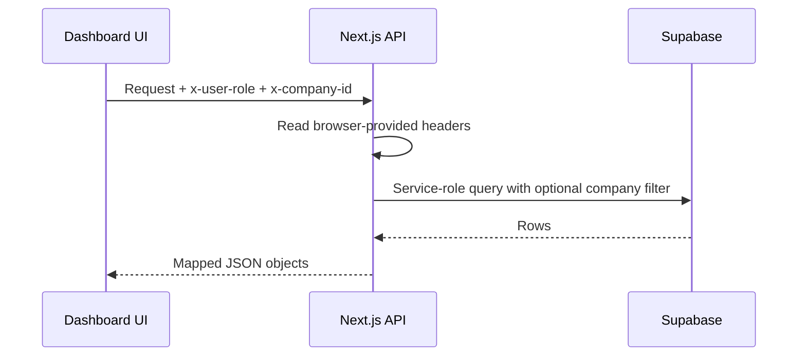

# HRFlow Technical Notes

## 1. Technology Stack

| Area | Implementation found |
|---|---|
| Web framework | Next.js 14.2.35 App Router |
| UI | React 18, TypeScript, Tailwind CSS, shadcn/Base UI components, Lucide icons |
| Charts | Recharts |
| Database | Supabase PostgreSQL through `@supabase/supabase-js` |
| Password hashing | `bcryptjs`, cost factor 10 |
| Email | Nodemailer with Gmail SMTP |
| AI | Google Gemini, model `gemini-2.5-flash` |
| QR generation | `qrcode` package |
| Deployment target | Next.js-compatible deployment such as Vercel |

`@anthropic-ai/sdk` is listed as a dependency, but no active integration was found in the scanned application code.

## 2. Project Structure

| Path | Responsibility |
|---|---|
| `app/` | App Router pages, layouts, and route handlers |
| `app/(dashboard)/` | Authenticated dashboard screens |
| `app/api/` | Backend HTTP route handlers |
| `components/` | Shared UI, navigation, forms, dialogs, and domain components |
| `contexts/` | Client-side authentication and shared HR data providers |
| `lib/` | Supabase clients, auth helpers, data mapping, AI helpers, OTP, email, and utilities |
| `supabase/` | SQL schema and migrations |
| `scripts/` | Password migration script |
| `data/` | JSON files used by the legacy fake-database API |
| `docs/` | Generated project documentation |

## 3. Frontend Architecture

The UI uses Next.js App Router pages. The dashboard layout supplies shared navigation and wraps pages with client-side context providers.

### Authentication State

The authentication provider stores the signed-in user in browser local storage under `hrm_auth`. It also writes an `hrm_auth` cookie that the middleware uses as an authenticated/not-authenticated signal. Forced password-change navigation is managed in the client provider.

### Shared HR Data

`HrmDataProvider` loads employees, attendance, leaves, payroll, jobs, applicants, performance, and announcements from separate APIs. It exposes shared data and mutation functions to dashboard pages.

### Settings Persistence

- Office Profile data is loaded from and saved to Supabase through `/api/office-profile`.
- Other generated settings data, including company details, departments, designations, and holidays, uses browser local storage under `hrflow_settings`.

### Role-Based UI

Sidebar navigation and many page actions are hidden or shown by role checks in client code. The intended hierarchy is:

```text
super_admin > company_admin > hr_manager > team_lead > employee
```

The numeric role-rank helper exists, but server routes do not consistently use it for authorization.

## 4. Backend Architecture

Next.js route handlers in `app/api` perform CRUD operations directly through the Supabase service-role client. There is no separate controller/service/repository layer for most modules.

The API map in `04-api-and-routes-map.md` identifies each endpoint and implementation file.

### Supabase Clients

- A browser-safe client uses `NEXT_PUBLIC_SUPABASE_URL` and `NEXT_PUBLIC_SUPABASE_ANON_KEY`.
- Server route handlers use `SUPABASE_SERVICE_ROLE_KEY` for privileged access.

Because the service-role client bypasses normal browser restrictions, every route must enforce authentication, role, and company scope itself. The current implementation does not do this consistently.

### Data Mapping

Mapper functions convert Supabase snake_case rows into frontend camelCase models. Several UI fields are generated or hardcoded rather than loaded from database columns, including manager relationships, employee location/gender, applicant resume score, announcement priority, and some performance values.

### Legacy JSON API

The `/api/hrm` routes use a file-based fake database under `data/*.json`. The primary dashboard provider uses the individual Supabase APIs instead. No environment-controlled switch between these two data paths was confirmed in the current code.

## 5. Authentication and RBAC

### Login

1. `/api/auth/login` looks up a user by email.
2. It compares the submitted password with `password_hash` using bcrypt when available.
3. During migration, it can compare against the legacy plaintext `password` field.
4. It returns user, employee, role, company, and password-change information.
5. The browser stores the result in local storage and a client-readable cookie.

### Route Protection

Middleware checks only whether the `hrm_auth` cookie exists. It does not verify a signed session, user identity, role, expiry, or company. API routes are excluded from this middleware.

### Company Isolation

The client sends `x-user-role` and `x-company-id` headers to many APIs. Routes generally add a `company_id` filter for non-Super Admin requests. These headers are browser-controlled and are not cryptographically tied to a verified user session.

Some routes apply no company scope. Some scoped routes skip filtering when a company ID is absent. Supabase Row Level Security policies were not found in the repository SQL.

### Password Lifecycle

- New users receive an eight-character temporary password.
- Passwords are hashed with bcrypt cost 10.
- The UI requires uppercase, lowercase, number, and minimum length eight for password changes/resets.
- The API change-password route enforces minimum length but relies on the client for the full composition rules.
- OTPs expire after 10 minutes; reset tokens expire after 15 minutes.
- Resend backoff is 1, 2, 5, 10, then 30 minutes.

## 6. Data Model Summary

| Table | Main purpose |
|---|---|
| `users` | Login identity, role, password state, and company link |
| `companies` | Company records for multi-company use |
| `employees` | Employee profile, employment data, salary, and company link |
| `departments` | Department names and optional heads |
| `attendance` | Daily time, status, QR, location, distance, and override data |
| `leaves` | Leave requests and approval state |
| `payroll` | Monthly salary, additions, deductions, net salary, and payment state |
| `jobs` | Recruitment vacancies and company link |
| `applicants` | Applicants and recruitment stage |
| `performance` | Review period, rating, goals, and feedback |
| `announcements` | Company/department announcements |
| `ai_chat_history` | Stored user/model AI chat messages |
| `password_reset_otp` | OTP, resend attempts, reset token, and expiration state |
| `office_profiles` | Company contact details, work rules, location, radius, and policies |
| `role_permissions` | Per-role View/Create/Edit/Delete flags for each application module |
| `document_templates` | Company-scoped reusable AI document content and variable placeholders |

The repository SQL does not define persistent `activity_logs` or `notifications` tables, even though such tables may have been manually created in a particular Supabase project.

## 7. Important Data Flows

### Company-Scoped List Request



### Location Attendance

The check-in API loads the employee's company and office profile. It calculates a Haversine distance in meters. A distance greater than the configured radius produces a `403` response; otherwise it records coordinates, distance, time, and status. With no configured location, it sets the first check-in coordinates as the office location.

### Leave Decision

The API updates the leave status and then attempts to send an email. An email failure does not roll back the leave decision; the successful response includes an email warning.

### Employee Creation

The employee row is inserted before the user row. If user creation fails, the route attempts to remove the employee. Credential email is sent after both records exist and is not part of a database transaction.

## 8. Email Architecture

`lib/email.ts` configures Nodemailer against Gmail SMTP on port 587. Email is sent synchronously inside API requests. There is no queue, retry worker, dead-letter handling, or delivery-status table.

Email triggers are documented in `05-email-notifications.md`.

## 9. AI Architecture

The Gemini helper sends prompts to `gemini-2.5-flash`, with a default temperature of 0.5, output limit of 2,048 tokens, and a 45-second request timeout.

The AI chat route detects English and Roman Urdu HR intents, loads related HR data, and asks Gemini for a concise response. Other endpoints generate documents, interview kits, anomaly explanations, churn-risk summaries, and monthly reports.

Several AI routes trust role/user information from request data and do not consistently filter all source data by company. AI output is advisory and may be inaccurate.

## 10. Environment Variables Found in Code

| Variable | Used for | Exposure |
|---|---|---|
| `NEXT_PUBLIC_SUPABASE_URL` | Supabase project URL | Browser and server |
| `NEXT_PUBLIC_SUPABASE_ANON_KEY` | Browser Supabase access | Browser and server |
| `SUPABASE_SERVICE_ROLE_KEY` | Privileged server database access | Server only |
| `GEMINI_API_KEY` | Gemini API requests | Server only |
| `GMAIL_USER` | SMTP account and sender | Server only |
| `GMAIL_APP_PASSWORD` | Gmail SMTP authentication | Server only |
| `NEXT_PUBLIC_APP_URL` | Links included in email | Browser-visible value |

No secret values are reproduced in this documentation.

Variables named `USE_FAKE_DB`, `FAKE_DB_PATH`, `FAKE_DB_SESSION_SECRET`, and `SUPABASE_PROJECT_REF` were not found as active code dependencies during the repository scan.

## 11. Time and Date Handling

Location check-in explicitly calculates the current date/time for `Asia/Karachi`. Other attendance paths use UTC ISO dates or the server's local `toTimeString()`. This can produce different dates or times around midnight or when the deployment server is in another timezone.

## 12. Background Processing

No cron jobs, job queues, background workers, or scheduler configuration were found. Attendance reminders, email delivery, reports, and AI generation run only when their API endpoints are called.

## 13. Testing and Operational Notes

- No automated test suite was found for API, UI, RBAC, or database behavior.
- The checked README is primarily the default Next.js starter content rather than project-specific instructions.
- The database seed includes sample users with a shared plaintext password; these are development fixtures and should not be used unchanged in production.
- A public one-time password-hashing route exists and should be disabled after migration.
- Database and frontend enums are not fully aligned in every module.
- The deployment must point to the same Supabase project where the schema and users were created.

## 14. Main Technical Assumptions

- A user normally has a linked employee record.
- Non-Super Admin users normally have a valid `company_id`.
- One office profile is expected per company, although a database uniqueness constraint was not confirmed.
- One attendance row per employee per date is expected, although a matching unique constraint was not confirmed.
- Email delivery and Gemini access depend on external credentials and network availability.
